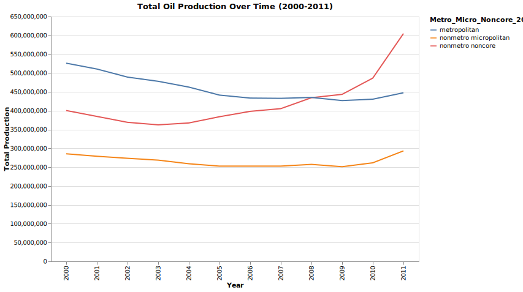

UOG.md

# Understanding Unconventional Oil and Gas Data: Definitions, Backgroud, and Health Impacts

In recent years, unconventional oil and gas (UOG) development has become a focal point in conversations about energy, environment, and health. With UOG operations like hydraulic fracturing and horizontal drilling on the rise, our ability to collect, analyze, and interpret the data about these activities has become critical. This data doesn’t just inform production trends—it has important implications for public health and environmental policy. Here, we’ll explore the nuances of UOG data: what it entails, how it’s collected, and why it matters for public health.

## Unpacking UOG: Definitions and Background

Unconventional oil and gas (UOG) refers to resources obtained through complex extraction techniques that differ from traditional oil and gas drilling. Unlike conventional wells, which tap directly into easily accessible resources, UOG extraction requires techniques like hydraulic fracturing (or fracking) and horizontal drilling to access deposits locked within dense rock formations, like shale or tight sandstones. These methods have made it possible to reach vast reserves previously deemed too difficult or costly to extract.

UOG extraction has driven economic growth, particularly in regions rich in shale, like Pennsylvania's [Marcellus Formation](https://www.dep.pa.gov/Business/Energy/OilandGasPrograms/OilandGasMgmt/Marcellus-Shale/Pages/default.aspx). While UOG production brings jobs and industry, it also poses a significant environmental and health risk. To better understand the effects of UOG, we can look to data describing UOG. These data cover everything from chemical usage and water consumption to pollutant emissions, providing insights into the environmental and public health impacts associated with UOG operations. But accessing, verifying, and interpreting these data is a complex task.

## The UOG Data Landscape

Data collected on UOG operations covers the gamut from economic, environmental, to health, each valuable for different reasons:

 * UOG development data, showing oil and gas development across geographies. An example is the USDA ERS's [County-level Oil and Gas Production in the United States](https://www.ers.usda.gov/data-products/county-level-oil-and-gas-production-in-the-united-states/documentation-and-maps/).
 
 * Chemical Emissions and Waste Data: Hydraulic fracturing uses mixtures of chemicals to release oil and gas from rock. UOG data captures information on these chemicals and the emissions produced, including methane, volatile organic compounds (VOCs), and other pollutants that may impact air and water quality.

* Water Usage and Quality Data: UOG operations require significant amounts of water. Data on water sourcing, chemical additives, and wastewater disposal helps track potential risks to water quality, especially where wastewater is injected into disposal wells or stored in open pits.

* Air Quality Metrics: Pollutants from UOG activities, such as benzene and nitrogen oxides, contribute to local air quality degradation. Tracking these emissions provides critical information for assessing the risks to nearby communities.

* Noise and Light Pollution Levels: UOG sites can generate significant noise and light, especially in populated areas. These data points inform our understanding of how UOG operations might affect sleep, mental health, and quality of life.

UOG data collection and quality standards vary widely. Differences in data collection methods, reporting standards, and transparency policies make it difficult to track the full range of impacts UOG activities have on the environment and public health.

## Case Study: UOGD Development Data
In 2014, the US Department of Agriculture released a [database of county-level oil and gas development data](https://www.ers.usda.gov/data-products/county-level-oil-and-gas-production-in-the-united-states/documentation-and-maps/) for the lower 48 states from 2000 through 2011. We can explore this data to investigate the geographical extent and centers of oil and gas production. 

## Why UOG Data Matters for Health and Policy

The growing collection of UOG data provides valuable insights, but without consistent standards, understanding the true impact of UOG activities can be a challenge. There are a number of ways this data is used to inform policy, protect communities, and drive research:

* Regulatory Compliance and Accountability: State and federal regulations on emissions, wastewater management, and noise aim to minimize UOG's environmental impact. Data can be used to support monitoring and enforcement, ensuring that UOG operators comply with standards meant to protect public health and the environment.

* Environmental Protection and Resource Management: Data on chemical emissions, air quality, and water use is critical for assessing UOG's impact on ecosystems. These insights are foundational for resource management policies that protect groundwater, rivers, and local wildlife from pollution.

* Health Research and Community Awareness: Public health researchers use UOG data to assess exposure risks, especially for people living near drilling sites. Without comprehensive data, it would be nearly impossible to evaluate the connections between UOG activities and specific health outcomes, from respiratory diseases to birth complications.

## Health Implications: What the Data Tells Us

The data collected from UOG sites reveal concerning links between UOG activities and public health risks. Communities located near UOG operations report increased incidences of certain health issues, which researchers are working to connect directly to UOG-related exposures.

* Respiratory Health Concerns: Air quality data near UOG sites often shows elevated levels of pollutants, including benzene and particulate matter, which can exacerbate asthma, chronic obstructive pulmonary disease (COPD), and other respiratory conditions, especially in vulnerable populations.

* Adverse Birth Outcomes: Researchers studying proximity data for UOG sites have linked UOG operations to increased rates of low birth weight, preterm births, and congenital anomalies. These findings underscore the importance of monitoring air and water quality in areas near drilling sites.

* Mental Health Impacts from Noise and Light Pollution: Constant noise, bright lighting, and increased truck traffic can have significant mental health impacts, particularly sleep disruptions and increased stress levels. Collecting noise and light data helps quantify these effects, which can guide regulations to limit these disturbances.

* Cancer Risk: Certain chemicals released during UOG operations, like benzene, are carcinogenic. Long-term data on air and water quality near UOG sites is essential for estimating cancer risks for nearby communities, offering an evidence-based foundation for policies that protect public health.

* Water Contamination Risks: Contamination of drinking water supplies is a top concern for communities near UOG operations. By tracking chemical usage and water quality, we can better understand and address the risks associated with wastewater disposal and the potential for groundwater contamination.

## Using UOG Data for Health and Safety Improvements

Data alone doesn’t automatically translate into policy change or community protection. However, by collecting and analyzing UOG data, researchers, regulators, and public health advocates can push for safer industry practices. Here are a few ways UOG data is currently being used to promote health and safety:

* **Supporting Health Studies and Monitoring Programs**: Health studies informed by UOG data establish relationships between exposure and health effects, providing a scientific basis for safety standards.

* **Increasing Public Awareness**: Public access to UOG data allows communities to better understand the risks of nearby UOG activities, empowering them to advocate for their health and safety.

* **Informing Policy and Advocacy**: Data-driven insights support advocacy for stronger regulations that limit emissions, safeguard drinking water sources, and protect communities from harmful exposures.

## Conclusion: The Power of Data in Shaping UOG’s Future

Unconventional oil and gas development has brought economic growth and energy gains, but it also carries significant environmental and health risks. Data collected from UOG operations—on air quality, water use, chemical exposure, and pollution levels—offers a powerful tool for understanding these impacts and safeguarding communities.

Gathering and interpreting UOG data requires dedicated effort, consistency, and, critically, transparency. With improved data collection standards and a commitment to community health, UOG data can inform the development of policies that balance energy needs with environmental and public health protection. By leveraging data, we can better understand UOG’s impact and protect human health and the environment.

## Sources:
* Center for Sustainable Systems, University of Michigan. 2024. "Unconventional Fossil Fuels Factsheet." Pub. No. CSS13-19.
* Deziel et al., Unconventional oil and gas development and health outcomes: A scoping review of the epidemiological research (2020)